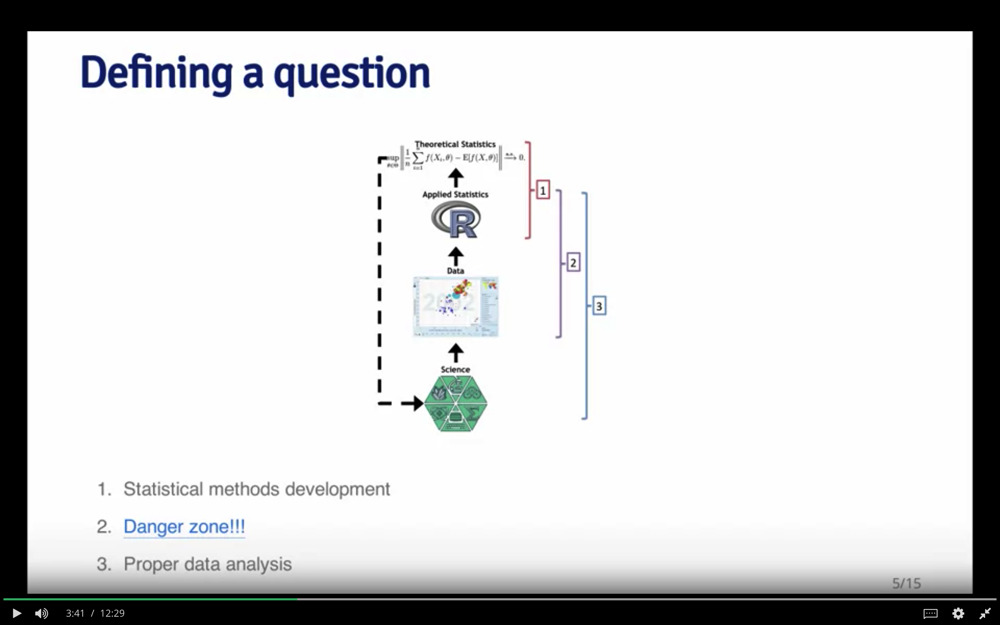
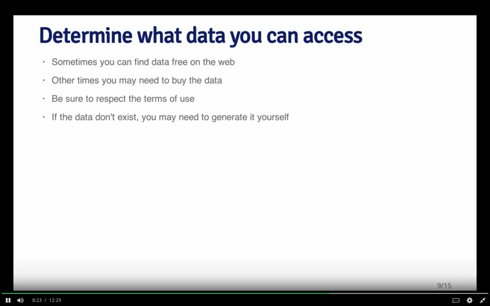
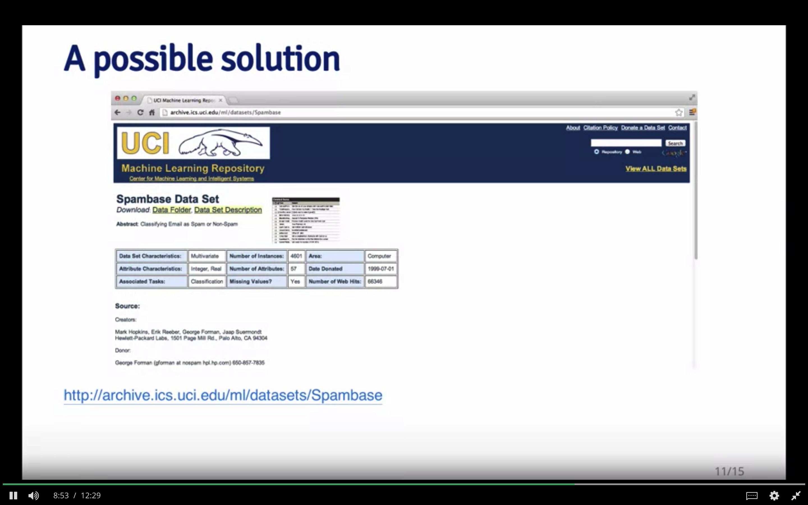
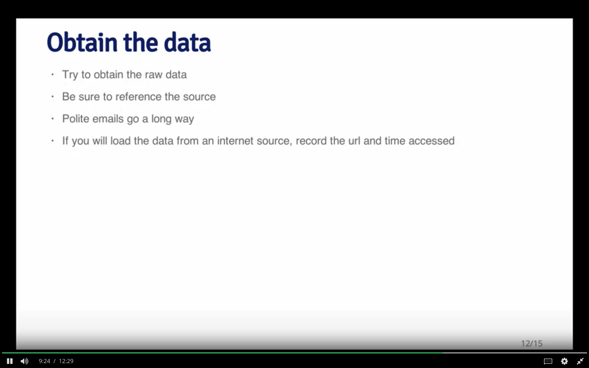
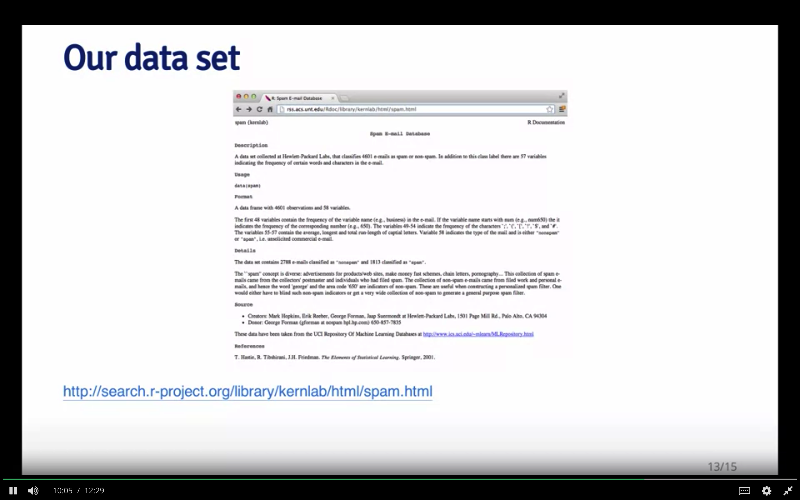
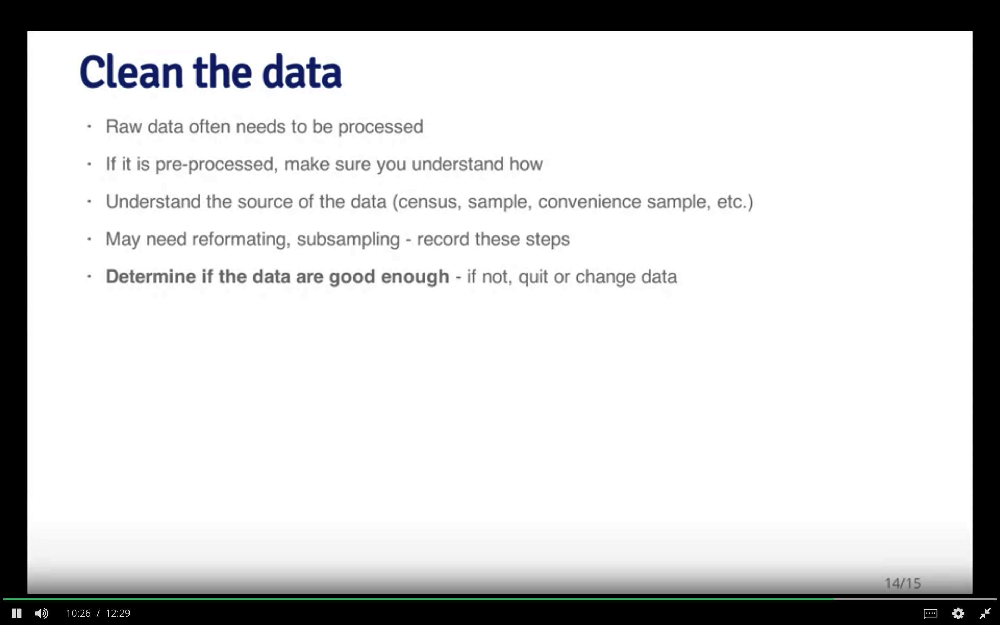
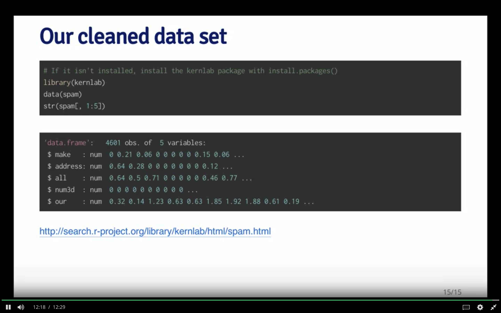
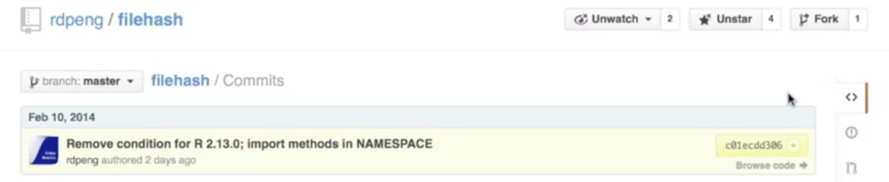

```{r setup, include=FALSE}
knitr::opts_chunk$set(echo = TRUE)
```

```{r findpath}
library(here)
here::here()
```
# Week 1 - Steps in Data Analysis

> I think the key challenge in, in pretty much any data analysis was well characterized by Dan Meyer who's a mathematics educator and he taught high school mathematics. In his Ted talk he said ask yourselves what problem have you solved ever, that was worth solving where you knew all the given information in advance. Where you didn't have a surplus of information and have to filter it out. Or you had insufficient information and had to go find some.

You have to sort though this

## Steps in a Data Analysis

1. Define the question. Put effort here. Best dimension reduction tool.
Be as specific as possible.    


2. Define the ideal data set.  Example: Can I detect spam mail?
Spam vs Ham. Can I use characteristics of emails to predict spam/ham?
What is the ideal dataset?

3. Determine what data you can access




4. Obtain the data





5. Clean the data





# Week 2

## Remaining steps in Data analysis

6. Exploratory data analysis
7. Statistical prediction and modeling
8. Interpret the results
9. Challenge the results
10. Synthesize results
11. Create reproducible code


## Processing our dataset


We will be using kernlab. The model has 58 variables.

## Steps in analysis

1. Split part into `training data` and the rest into `test data. Do a random
split using `rbinom()`. This will generate data for training the model and
unused `test` data for testing the model.

2. Exploratory data analysis

Here we probe the data set.

- What does it look like?
- Do we see relationships?
- Generate summaries
- Look for missing data

## Our data set

```{r ourDataSet}
library(kernlab)
data(spam)
str(spam[, 1:5])
```

Splitting the data set

```{r splitSpam}
set.seed(3435)
trainIndicator = rbinom(4601, size = 1, prob = 0.5)
table(trainIndicator)

```

`training`: names - all are words. 1st 5 are frequencies of words in our dataset.

```{r getTheSets}
trainSpam = spam[trainIndicator == 1, ]
testSpam = spam[trainIndicator == 0, ]
```


Look at the head of the training sets

```{r lookAtTraining}
head(names(trainSpam), 20)
```

If you look at the first five rows, we can see that basically
these are the frequencies at which they occur in a given
email.

```{r lookAtTen}
head(trainSpam[, 1:10])

```

If we look at the training data set and look at the outcome, we see that 906
of the emails are spam, are classified as spam.

```{r tableNext1}
table(trainSpam$type)
```

We can make some plots and we can compare,
what are the frequencies of certain characteristics between
the spam and the non spam emails.
Here we’re looking at a variable called capitalAve, the average number of
capital letters.

```{r spamBoxPlot}
boxplot(capitalAve ~ type, data = trainSpam)
```

Lets use a log tranformation for this plot. It’s okay to do that in this case.

```{r spamLogBoxPlot}
boxplot(log10(capitalAve + 1) ~ type, data = trainSpam)
```


## Make some plots of certain characteristic 

- Avg num of capital letters.
- Use a `log transform`: Add 1 to data to solve log problem.
- Spam has more capital letter than non-spam

We can look at pairwise relationships between the different
variables in the plots. Here I’ve got a pairs plot of the first
four variables, and this is the log transformation of each of
the variables.

```{r pairsLog10Spam}
pairs(log10(trainSpam[, 1:4] + 1))
```

Structure of a Data Analysis: Part 2

Next, I plotted the Dendrogram just to see how what predictors or what
words or characteristics tend to cluster together.

```{r hclustPlotSpam}
hCluster = hclust(dist(t(trainSpam[, 1:57])))
plot(hCluster)
```

But if you recall, the clustering algorithms can be sensitive to any skewness
in the distribution of the individual variables, so it may be
useful to redo the clustering analysis after a transformation
of the predictor space.

```{r hcluUpd}
hClusterUpdated = hclust(dist(t(log10(trainSpam[, 1:55] + 1))))
plot(hClusterUpdated)
```

It has separated out a few clusters and this `captialAve` is one kind
of cluster all by itself. There’s another cluster that includes
“you will” or “your”. And then there are a bunch of other
words that lump more ambiguously together. And so this
may be something worth exploring a little bit further, if you
see some particular characteristics that are interesting.

Once we’ve done exploratory data analysis, we’ve looked at
some univariate and bivariate plots, we did a little cluster
analysis, we can move on to doing a more sophisticated
statistical model and some prediction modeling. And so any
statistical modeling that you engage in should be informed
by questions that you’re interested in, of course, and the
results of any exploratory analysis. The exact methods that
you employ will depend on the question of interest. And
when you do a statistical model, you should account for the
fact that the data have been processed or transformed, if
they have, in fact, been so. As you do statistical modeling,
you should always think about, what are the measures of
uncertainty? What are the sources of uncertainty in your
data set?

## Statistical Modeling

Here we’re going to just do a very basic statistical model.
What we’re going to do is we’re going to go through each
of the variables in the data set and try to fit a generalize
linear model, in this case a logistic regression, to see if we
can predict if an email is spam or not by using just a single
variable.

Here, using the reformulate function to create a formula
that includes the response, which is just the type of email
and one of the variables of the data set, and we’re just
going to cycle through all the variables in this data set
using this for-loop to build a logistic regression model, and
then subsequently calculate the cross validated error rate of
predicting spam emails from a single variable.

```{r spamPart1}
trainSpam$numType = as.numeric(trainSpam$type) - 1
costFunction = function(x, y) sum(x != (y > 0.5))
cvError = rep(NA, 55)
library(boot)
for (i in 1:55) {
   lmFormula = reformulate(names(trainSpam)[i], response = "numType")
   glmFit = glm(lmFormula, family = "binomial", data = trainSpam)
   cvError[i] = cv.glm(trainSpam, glmFit, costFunction, 2)$delta[2]
}
```


Now,

```{r tryToPred}
## Which predictor has minimum cross-validated error?
names(trainSpam)[which.min(cvError)]
```

Once we’ve done this, we’re going to try to figure out which
of the individual variables has the minimum cross validated
error rate. And so we can just go, and you can take this
vector of results, this CV error, and just figure out which
one is the minimum.

It turns out that the predictor that has the minimum cross
validated error rate is this variable called charDollar. This is
an indicator of the number of dollar signs in the email. Keep
in mind this is a very simple model. Each of these models
that we fit only have a single predictor in it. Of course we
could think of something more complicated, but this may
be an interesting place to start.

If we take this best model from this set of 55 predictors, this
charDollar variable, and I’ll just re-fit the model again right
here. This is a logistic regression model. We can actually
make predictions now from the model on the test data.
Recall that we split the data set into two parts and built the
training model on the training data set. Now we’re going to
predict the outcome on the test data set to see how well we
do.

In a logistic regression we don’t get specific 0/1 classifications
of each of the messages, we get a probability that a
message is going to be spam or not. Then we have to take
this continuous probability, which ranges between 0 and 1,
and determine at what point, at what cutoff, do we think
that the email is spam. We’re just going to draw the cut off
here at 0.5, so if the probability is above 50%, we’re just
going to call it a spam email.

```{r genPredModel}
## Use the best model from the group
predictionModel = glm(numType ~ charDollar, family = "binomial",
                      data = trainSpam)
## Get predictions on the test set
predictionTest = predict(predictionModel, testSpam)
predictedSpam = rep("nonspam", dim(testSpam)[1])
## Classify as `spam' for those with prob > 0.5
predictedSpam[predictionModel$fitted > 0.5] = "spam"
```

Once we’ve created our classification, we can take a look
at the predicted values from our model, and then compare
them with the actual values from the test data set, because
we know which was spam, and which was not. Here’s the
Structure of a Data Analysis: Part 2 46
classification table that we get from the predicted and the
the real values.

```{r makeSpamTable}
table(predictedSpam, testSpam$type)
```

Now we can just calculate the error rate. The mistakes that
we made are on the off diagonal elements of this table, so
61 and 458. So, 61 were classified as spam that were not
actually spam, and 458 were classified as non spam but
actually were spam. So we calculate this error rate as about
22%.

```{r calcErrorRate}
## Error rate
(61 + 458)/(1346 + 458 + 61 + 449)
```


## Interpreting Results

So far we’ve done the analysis, calculated some results,
calculated our best model, and looked at the error rate that’s
produced by that model. Now we need to interpret our findings and
it’s important when you interpret your findings
to use appropriate language and to not use language that
goes beyond the analysis that you actually did. If you’re in
this type of application where we’re just looking at some
data and building a predictive model, you want to use words
like, “prediction” or “it correlates with” or “certain variables
may be associated with the outcome” or “the analysis is
descriptive”. Think carefully about what kind of language
you use to interpret your results. It’s also good to give
an explanation for why certain models predict better than
others, if possible.

If there are coefficients in the model that you need to
interpret, you can do that here. And in particular it’s useful
to bring in measures of uncertainty, to calibrate your
interpretation of the final results. In this example, we might think
of stating that the fraction of characters that are dollar signs
can be used to predict if an email is spam. Maybe we decide
that anything with more than 6.6% dollar signs is classified
as spam. More dollar signs always means more spam under
our prediction model. And for our model in the test data set,
the error rate was 22.4%.

## Challenge the Findings

Once you’ve done your analysis and you’ve developed your
interpretation, it’s important that you, yourself, challenge
all the results that you’ve found. Because if you don’t do it,
someone else is going to do it once they see your analysis,
and so you might as well get one step ahead of everyone by
doing it yourself first. It’s good to challenge everything, the
whole process by which you’ve gone through this problem.
Is the question even a valid question to ask? Where did the
data come from? How did you get the data? How did you
process the data? How did you do the analysis and draw any
conclusions?

If you have measures of uncertainty, are those the appropriate measures of
uncertainty? And if you built models,
why is your model the best model? Why is it an appropriate
model for this problem? How do you choose the things
to include in your model? All these things are questions
that you should ask yourself and should have a reasonable
answer to, so that when someone else asks you, you can
respond in kind.

It’s also useful to think of potential alternative analyses that
might be useful. It doesn’t mean that you have to do those
alternative analyses, in the sense that you might stick to
your original just because of other reasons. But it may be
useful to try alternative analyses just in case they may be
useful in different ways or may produce better predictions.

Use appropriate language in interpretation. Explanations are helpful
along with uncertainty.

Challenge process and analysis...

Synthesis is important - winnow to a coherent report. Focus as a question and
summarize. **Coherent story** order fit story, order isn't usual helpful. 
Well done figures help!!!

Reproducible code - document as you go.


How to organize. One size doesn't fit all. General ideas

Data Raw & process

Figures and tables, final figures. Well annotated

R code: used and unused, final scripts..., rmarkdown, test report...

Raw data - processing, cleaning, ... store raw and processed and provenance. Version control - add raw data if it fits...

Processed data - cleaned. named well... Tidy...

Exploratory figures... Quick looks. Not all incorporated

Final figures - more polished. Journal: typically at most 4-5 annotated well

Lots of scripts. Lots don't make final cut... Stored sep from final

Final scripts - much better commented, cleaned...

Rmarkdown scripts.... Tend to be more final... Readme less useful with Rmd

Text of report title, intro, methods, results, conclusions - get a coherent story and references.

# Coding standards in R

Coding standards in R are really important because they help you make your code readable and allow you and other people to understand what's going on in your code. Now of course just like it is with any other style you know whether it's your clothing or whatever it is, it's difficult to get everyone to agree on one set of ideas. But I think there are a couple of very basic, kind of minimal standards that are important when you're coding in R. All right, so I'm just going to talk a little bit about some of the coding standards that I think are important when you're writing R code. And I think will help make your code more readable and more usable by others if that's what you're trying to, to achieve.

So the first principle that I think is very important in pretty much any programming language, not just R. Is that you should always write your code using a text editor and saved as a text file. Okay so a text file is a kind of basic standard that usually doesn't have any sort of formatting or any sort of kind of special appearance. It's just text.

The second principle, is, which is very important for readability, is to indent your code. So indenting is something that's often hotly debated in lots of mailing lists and other types of discussion groups, in terms of how much indenting is appropriate. Now, I'm not going to talk about that, although I do have some recommendations. But I think the most important thing is that you understand why indenting is important. So indenting is the idea that different blocks of codes should be spaced over to the right. A little bit more than other blocks of codes so, you can see kind of how the control flow, how the flow of the program goes based on the indenting alone.

So coupled with indenting is the third principle which I think is very simple which the limit the width of your code. So, you have indenting, it's possible to kind of indent off to the right forever. So you need to limit on the right hand side how wide your code is going to be, and usually this is kind of determined by number of columns of text. And so one possibility is you limit your text to about 80 columns. Of text and then, and so that you're, the width of your code never exceeds that. So, let's take a look for, at a quick example here. So, here you can see I've got our studio open here. With this simple code file with some R code in it. And, and, first of all, let me just mention that the editor in our studio is a text editor. So, it will always save the R files that you write as text format files. so, we've already got that kind of handled. But you can see, the indenting scheme here is equal to one space. So every indent is one space. And you can see that all of the code is kind of mashed together here on the left-hand side. It's difficult to tell kind of where the if blocks are, where the else blocks are, where does the function kind of end and begin. And so the indenting scheme kind of makes the code not very readable in this case. So we can change the indenting in our studio. And if I just go up to the preferences menu here and go up to code editing and let me just change it to four and you can see that the column the margin column is set to 80 characters. So it will show you the margin when you've reached 80 characters.

And so I'm going to select all here with the command a and then command i to indent this. So now you can see that the indenting is a little bit nicer now. You can see, kind of where the function begins and ends. You can see where the if blocks start and end. and, and the kind of structure of the program is much more obvious. so, I'm going to change this one more time, though. And, and my, my personal preference for indenting is to use eight spaces. So I'm going to change this to eight.

Hit OK and Select All > Cmd+I. And now you can see I I prefer the eight spaces just because it really makes the structure of the code very obvious. And the spacing is nice and clear and it makes the code very readable in general. So you can see that indenting is very important. And the biggest problem you might have is with too little indenting. If you don't indent at all or if you only use a very small amount, the code becomes kind of very mashed together. So I recommend at least 4 spaces for an indent. And I prefer eight spaces for an indent, just because it makes the code much more readable and spaces it out much more nicely. One of the advantages of having something like an eight space indent is coupled with an 80 character margin on the right hand side. Is that it forces you to think about your code in a slightly different way. So for example if you have eight space indents if you are going to have a four loop nested within another four loop within another four loop. Every time you nest another four loop for example you have to indent over eight spaces. And by the time you get to maybe your fourth nested four loop. You're pretty much hitting the right hand column at the 80 column margin, right? And so the nice thing about the eight space indent, coupled with the 80 column margin. Is that it prevents you from kind of writing very basic, making kind of very kind of fundamental mistakes with code readability. So for example with eight space indent, and 80 column margin. You might be able to do easily more than two nested four loops. And but I think that's really the kind of the, the boundary of what is readable in terms of code. Typically, except for some special cases, a three, you know, a three nested or four nested for-loop is difficult to read, and it's probably better off splitting off into separate functions or something like that. So you know, a good indenting policy not only, makes the code more readable. But it actually can force you to think about writing your code in a slightly different way. And so that's a really nice advantage of, of, of having a logical indenting policy with, coupled with a, you know, a right hand side restriction, right?

So the last, thing I want to talk about is to limit the length of your functions. Alright, so functions in R can, can theoretically go on for quite a long time and, of course, just like in any other language. But just like in any other language, I think the logical thing to do with the function is to limit to kind of one basic activity. So, for example, if your function is named, read the data. Then your function should simply read the data. It should not read the data, process it, fit a model, and then print some output, alright? So you should, the logical kind of steps like that should probably be split into separate functions. There are a couple of different advantages to doing this. First of all it's nice to have a function written on a single page of code. So you don't have to scroll endlessly, to see you know where all the code for this function goes. If you can put all the function, the ent, the entire function on like, one screen of the editor, then you can look at the whole function and see what it does all at once. Another advantage of splitting up your code onto logical sections, to logical functions is that if you use functions like trace back or, or the profile or the debugger. These often tell you, you know, where in the function call stack you are when a problem occurs. And if you have multiple functions that are all logically divided into separate pieces. Then when a bug occurs and you know it occurs in a certain type of function, or a certain function, then you know kind of where to go to fix things, right? So if you, but if you just have a single function that just goes on forever and a bug occurs, then the only thing that the debugger or the traceback or the profiler can tell you is that there's a problem in this one function. But it doesn't, it's difficult to tell you where exactly the problem occurs. So splitting up your functions has a secondary benefit which is that it can help you in debug and profiling. So limiting the size of your functions is very useful for readability and for kind of debugging. Of course, it's easy to go overboard and to have, you know, 100 different three line functions. So that's not really what you want to do. So you just want to make it so that the, the separation of different functions is logical and each function kind of does does one thing in particular.

So those are my basic guidelines for writing code in R there of course there are many other things that you might be able to think about. But then you bordering into areas that we might not we might kind of disagree on and so I'm not going to talk about it too much more in terms of coding standards. But the basic ideas are, always use a text editor, always indent your code, I'd say at least four spaces.

Limit on the right-hand side how, how wide your code can be.

And and always limit the size of your functions so that you can, so that they're kind of grouped into logical pieces of your program. So with those four things I think you'll, your, your code will be much more readable. It will be readable to you, it will be readable to others. And it will make kind of writing our code much more useful to everyone.

# Markdown

Markdown is a really useful language for creating documents without having to deal with a lot of the overhead and kind of complications of using standard markup languages. The idea behind Markdown is that it's a, you know, it's a simplified markup language. And it really, the, the goal is to, to allow you to focus on just writing your content and not have to worry about things like tags or other things like that. And so Markdown, you'll notice, is very simple. And we use it a lot here. All of the slides for the course are written in Markdown And a nice thing about Markdown is that it's very easy to integrate it with Rcode, and other programming languages. So, in this lecture I'm just going to talk about the very basics of Markdown. But of course it, beyond the basics actually there's not a whole lot. So that's what makes Markdown so, so nice. And then once I'll just talk a little bit about kind of the basic aspects and give, give you a few pointers on kind of where you can go to learn about more.

So,just to start off with, Markdown is a text to HTML conversion tool for web writers. Markdown allows you to write easy, using an easy to use, read, easy to write, plain text format and then convert to structurally valid XHTML. So the idea is that, so the, John Gruber, the creator of Markdown, wanted people to be able to focus on writing their content, and not other kind of aspects.

And so, the basic syntax for Markdown is fairly simple. For, so, you can you can format text, for example with italics using the asterisks here and then the text will be italicized. You can do things like create bold face with the, with the double asterisk and the text will appear bold. You can create headings.

There are different sizes, so if you're familiar with HTML you can think of this as H1, H2, H3. So the two hashes, this is a secondary heading. The three hashes is a tertiary heading. And then a single hash, which I didn't put here is a, is like a main heading, a primary heading. And so you can see that there are different sizes here.

You can create very simple unordered lists by putting a little indicator there, like a hyphen or an asterisk. It doesn't really matter what the the character is that you use there as long as it's kind of consistent across the list. So you can create an unordered list like this by just just starting it right away, there's no other formatting element. You can create an ordered list here by just doing one, two, and three. And the, and, and the truth is actually, although it's a little, it's not immediately clear here the numbering doesn't have to actually be in order. As long as you use a number as the kind of character that, kind of, that indents the line it will cr-, the Markdown will create an ordered list. And so, if you decide that oh, you know, you want to stick something in between one and two, you don't have to renumber every element on the list. You can just stick another item there under the first item. And it could be another one, or it could be four, it could be any number, the numbers don't have to be in order, but when you process the document Markdown will automatically order the list in the right way.

You can of course put links into a document, this is very important if you're creating web documents. And there are two ways to create links. The first way I've got here puts the text in square brackets, and then immediately following that puts the URL in parenthesis. So, here I can see Johns Hopkins Bloomberg School of Public Health. And and the URL is right next to it, and then Download R with the R website right next to that. And so and then it'll be formatted in an HTML document in the usual way. The text will be highlighted, and underlined.

The other way to to create links in a Markdown document is to put the, again, the text in square brackets. And then, and right next to it in square brackets put a number which is going to be like an identifier for that link. And then later on, perhaps at the bottom of the document you can put the actual URL for for the length that you meant. So, number one here is for R bloggers and at the bottom of the document I might put a number one and then the R bloggers URL. And then the second link here is for Simply Statistics, so for number two I put the Simply Statistics URL. The basic idea with this type of linking is that it makes the text in your document a little bit cleaner and easier to read. Especially if you have very long URL's. And you, and you don't necessarily want to put all these really long URL's in the document so it makes it hard to read. This makes it a little bit easier to read, while your editing the document and puts all the links down at the bottom.

Lastly new lines can be created in the text document by just putting a double space at the end of a line. So I just do first line, second line like this with just, with no space after the first line. All the lines will run together like that. But if I put two spaces after the first line then you'll get a kind of a new line put in between. So just the, that's going to be just an easy gotcha, that can be the people who newly come into Markdown will often discover. So that's just a really, really quick overview of Markdown. Here's some basic resources of the official Markdown documentation on, on Jon-, John Grubers website, is very easy to read, it's very, it's relatively short. You'll be able to learn it within minutes. You already know most of it just by readin-, by looking at this lecture. And then, Github has its own kind of Markdown flavor, with a few kind of enhancements. So if you're going to be using Github and documenting things in Github it might be useful to check out their Markdown guide.


# Rmarkdown

This lecture's going to be about R markdown. It's going to be a very short and just description of what this is, because I talk about it in a little bit more detail when I talk about reproducible research. So the basic idea behind R markdown is that you want to have R code integrated with a simple language that can be used to kind of create documents. And so the coupling is going to be the R language with the markdown language. So, first of all, what is markdown? So markdown is a very simple kind of markup language, kind of play, a play on the word markup language. And the idea is that the, the mark, markdown is designed to help you focus on actually writing things, right. So when you think about it, if you're experienced with languages like HTML or La Tec, or, or some of these other, or XML, or some of these other things. you know, one of the things that you notice that you spend a lot of time thinking about the formatting, and, and thinking about everything else except the actual content that you're trying to produce. And so the basic philosophy behind markdown is say, is to create a language that allows writers to, to do writing basically. Right? And so if you look at markdown it looks very different from other types of, of kind of markup languages like XML or HTML or LATEC. And so there are just very simple, very minimal, kind of intuitive formatting elements things like boldface and, and and sections and lists. And so be kinds of things that you would typically need in a basic document but not the very fancy things that you might have. But one of advantages of markdown is that it, you can insert kind of arbitrary HTML elements. So if you are familiar with HTML and you want something that's specific or particular, and there isn't a basic markdown formatting element for it, you can just put some HTML in, in the worst-case scenario. So one of the nice things about markdown is, it's easily converted into HTML. There are tool chains out there that'll take markdown, and in fact convert it into many different formats, HTML just being one of them. So you can let a lot of information at the website of, of John Gruber, where he has a lot of documentation for markdown, and a little bit of background on kind of how, how this, how this project evolved. So, that was markdown. What is R markdown? So R markdown is basically the coupling of R code in a markdown document. So, the idea is that if you want to embed R code, in a document that's written in markdown, you use R markdown. And the, the basic idea is that this, it's going to look a lot like a standard R mark, I'm sorry, a standard markdown document. But there's going to be R code sprinkled in, in, in what are called code chunks. And the code chunks'll be denoted by a special formatting tags, which I'll show you in a little, in a minute. So when you integrate R code with markdown that's an R markdown document, typically has the r m d extension. And so the nice thing about using R markdown is it allows you to insert essentially live R code into a markdown document. So when you process the markdown document to create your HTML or your PDF ultimate you know, format, um,you can evaluate the r code in as part of the processing for markdown. And so, so you know that the code in the document if you're trying to demonstrate a tool, or you're trying, you know maybe show some data or whatever it would be. You know, that the code works in the document because in order for a document to be produced in the first place the code had to be executed and evaluated and run. And so everything in the document, any code that you see in a document, you know will work. Because it had to, it had to work to create the document. So that's one nice thing about being able to embed live R code in a document is that you can ensure a, a, some, a certain level of validity of the R code. So the basic idea is the, you know, you evaluate R code it, the, the results of the R code is, is inserted into the markdown document. And mark, R markdown is a core tool in what's known as literate statistical programming. And we'll talk about that a little, much more when we talk about reproducible research. But for now, it's important just to think of R markdown as a way to put R code in a document.

So you can evaluate R markdown documents using the knitr package in R. So the knitr has a, knitr essentially reads an R markdown file, evaluates all the R code in it, it kind of sticks in the results of the R code, and then writes out a Markdown file. Now, that Markdown file can be converted into HTML using the markdown package in R. And so there's a bit, so there's a kind of extra step of the pipeline here. If you were just going to write markdown you could just convert that to HTML right away, but if you're going to write R markdown, then you need to use something like knitr, to kind of evaluate the R code, create the markdown document, and then, bring it to an HTML file.

So the knitr package and the markdown package are, are important for this. Any basic text editor can be used to create a markdown document, or R markdown document. That's one of the nice features of this type of markup language is that you don't need any fancy editors to visualize what you're trying write, you can just use any old text editor and it will be fine; you don't need any special editing tools. So the, the basic workflow that you're going to use if you write in R markdown is, R, you write in an, you kind, your basic, your core document is an R markdown file, so it has markdown formatting elements and it has R code in it. Then you convert that into a markdown file using the knitr package, and then you take that markdown file, which is essentially an intermediate file that you're, you're not going to edit this file, and you would take that markdown file, and you convert it to HTML using the markdown package. And then HTML is kind of what you would view in your browser or other viewer. So the, the, now, the key elements of all this is that you don't, you never edit the intermediate or final products, so you never edit the markdown file and you never edit the HTML file. The only file that you're ever going to edit is the R markdown file which has the kind of original R code and original markdown in it. The whole workflow is very easily managed, if you're using something like R Studio. R Studio has knitr and markdown integrated into it and furthermore even has a little web browser built in so you can actually view the final product, if you're using R Studio, and I'll show a little demonstration of how to do that in R Studio. and, and just as one very quick example, the slides that you're looking at right now they were written in R markdown. Of course, there's no R code in here, so it's, it's more or less just plain markdown, but I built these slides using the slidify package which calls knitr and the markdown packages, to convert them into HTML. So you can, there's a lot of flexibility when you're using a format formatting language like R markdown or just markdown and you can, because you can convert them to a lot of different other presentation styles.

# R Markdown Demonstration

So this is just going to be a quick demo on how to create and edit a R marked down document so you can see I got RStudio launched here and nothing's open. So I'm just going to start up create a new document in our mark down so I can go to the menu here and there's a couple of options of different types of files you can open. So I'm going to create an R markdown file and you can see that actually it starts right at RStudio actually populates the document with a little bit of kind of filler material just to get you started. So in case you're not familiar with mark down, you can see a little bit of how it's done. So let me just show you the whole thing here and I think the easiest thing to do right now just let we can just knit this document we can run the document through Knitter. It's going to run the our code. It's going to produce the markdown file. It's going to convert the markdown found HTML and then launch it in RStudio's little web browser. So why don't we just click on the knit HTML button?

And see what happens.
So I first have to save this file. So I'll just call it markdown demo.
And I'll use the file extension Rmd, which is traditional. But not necessary. You can see it's running, processing the file and it produces this nice HTML output. So you can see it matches the title. It has the text is just plain text. The R code is in put in the gray boxes and the output from the R code is right below it. There's more R code here which is the plot and you see the plot just appears right here. So it's nice in that this document here, which only has R code in it can be evaluated and the output can be embedded inside the output document without you having to create a plot separately and then kind of include it and then you get a nice document like this. So but this obviously is not the document that we wanted to write. So the first thing you're going to have to do typically is just erase everything here. So the first thing you want to do is probably start to put some sort of title in so you can call it something like my first R markdown file. And if you put this kind of equal sign under here, that'll make it look like a title and then also and then you can add some text here. This is my first R Markdown file.

Here is we're going to load some data. And then here I'm going to add some R code. I want to load some data to either plot it or maybe fit a model. So the first thing you want to do is is three back ticks here and with the curly braces you can wrap the the letter r in curly braces lowercase R. Now you can see how the highlighting changed a little bit in the editor. So now I'm going to be writing R code right? So maybe the first thing I want to do is I'll load the air quality data set from R which is a very basic data set that has data on ozone. So I'm going to load it from the datasets package.

It's called air quality.

And I'll just call summary on it. Just to see what it's about. Okay, so now I can close the R code chunk with three back ticks again. You can see that the format the highlighting changes now to just plain text. Okay. So the first code chunk it basically loads the datasets package loads the air quality data set which is a data frame and then gives me a little summary and then maybe the next thing I want to do is do a summary plot. So I'm going to open another R chunk and I'm going to take my air quality data set. I'm going to call pairs on it and make a pairs plot. Who knows what that will look like? Probably you want to have a little descriptive text here just so I'm not flying blind here. So, let's see.

So now I'm going to make a pairs plot of the data. So I'm going to save this file. I can also hit Apple S on Mac and I'm going to hit I'm going to knit it so you can see it processes, the process of the file and here you can see the R code that I wrote. Here's the summary which is just for each column in the data frame. It just gives me a little kind of five number summary plus the mean and tells me how many NAs there are in each if there are any so you can see that for example, the median ozone is 31.5 and the median wind is 9.7, and the median solar radiation is 205. So that's just a little bit of summary data. I can make you look at the pairs plot at the data right here when I saw I called the pair's function on the whole data frame and you see that all the pairwise bivariate relationships between all the variables in the data set. So you see it's not a very large data set. There are only six variables in it and I can see how they're related to each other. So lastly I might want to fill a little regression model so here's a regression model.

Of ozone on wind solar radiation and temperature. So I'll start a code chunk again three back ticks and the R in curly braces. I'm going to fit a regression model here. So I need the stats package. Typically the stats package will be loaded already when you start up R but just to be safe I'll load it explicitly. And I want to fit a model here so I'm going to call the LM function. I'll say ozone is related to wind solar radiation and temperature and the dataset is the air quality data. And then I'm going to summarize this fit because I want to look at regression coefficients and standard errors and P values and things like that. So I'll close that code chunk.

I'll save my file. So let me just double check that I save it yes I did and then I'll admit it. And now you can see after the pairs plot if I scroll down. I've got my regression model fitting code so you can always reproduce the code if you want by just kind of cutting and pasting that code in there and you can see the output from the regression model is right here. So it seems that all three of those variables wind, solar, radiation and temperature all appear to be associated with ozone. So this is a quick demo of how you can start an R markdown file. Basically you have to know how to write text which is fairly straightforward and you have to know how to write R code which hopefully you do after this course and then once you know how to do that you can mix and match these things together. There are a couple other important formatting elements that you can check out on the website that I pointed to in the slides. For example here, you can write an unordered list so like this and you don't have to do much thinking about it you just start adding things.

And then you get yourself an unordered list. So if I save this and then knit it up.

See everything else before looks the same but I got my little unordered list down here which is using bullets. So there are a couple other formatting elements like that. You can add raw HTML and if you're familiar with LaTeX using the knitr package, you can also have LaTeX in it so you can add mathematical annotation. So that's a quick demo of Rmarkdown. So check out RStudio and you can start editing your first Rmarkdown file in the editor and see how it looks.

# Knitr Part-1

This lecture's going to be about literate statistical programming. In the lecture about reproducible research, I talked about the basic ideas of what it means for an analysis to be reproducible. But now I'm going to talk about one of the tools that you can use to actually make your analysis reproducible by others, or at least help other peoples to kind of reproduce your analysis. And one of the ways that we talked about making reproducible documents was to put this literate statistical programming, literate statistical programming concept, or just literate programming. And so the basic idea is that, you know, authors have to undertake a lot of effort to put data and results on the web. And even when they put that stuff on the web, they, they're all kind of separate. The data's over here, the code is over here, and you kind of have to figure out well, which code goes with which, which data and how do you, what, how do you escape this code and do you load this first, do you do this first, and so, there can be a lot of confusion even when everything is just available. And, and so. One of the ways you can simply that process is to put the data, and the code together in the same document so to speak so that people can execute the code in the right order, and the data are read at the right times. So you can have a single document that integrates the data analysis with all the textural representations so the words that you use to describe was going on. And so you don't have that everything kind of separate pieces but everything's kind of linked together.

So, the, the, the original idea of how literate program comes from Don Knuth. He was a computer scientist at Stanford and his original system was for writing just regular computer programs and, and documenting the computer code at the same time as writing the code. So the basic idea translates over to a literate statistical program where you want to document your analysis and similarly have the code for your analysis in the same document. And so the ideas and article's a string of text and code and analysis code is divided into text and code chunks. And so the presentation code formats the tables, formats figures, things like that. There's article text that talks about what's going on. And then these literate programs, there's two concepts, you can weave them into readable, human readable documents, and you can tangle them to produce machine readable documents or just code files. So, literate programming, as I said before, is a general concept. You need a documentation language and a programming language. So the original Sweave system that I talked about before, written by Fritz Leisch, used LaTeX as the documentation language and R as the programming language. So on this lecture I'm going to talk about knitr, which supports a variety of documentation and programming languages. And so the first thing you want to start with, so the basic question is, how do I make my work reproducible? And the basic answer to that is that you have to decide to do it, okay. And you can decide to do this at any point in your, in your analysis, but it's usually easiest to do it at the very beginning. If you decide at the very end that you want to make your analysis reproducible, then it often is much harder to do and maybe even impossible. And, and so we want to keep track of things as you go along. You can use a version control system like Get of SVN. I won't talk about that here but if you've heard about that that is a good thing to learn.

It's important to use software, statistical software, whose operation can be coded. So the idea is that you can write down the instructions that were used to manipulate or analyze the data. So this generally rules out graphical user interfaces unless those programs will code or keep track of all the clicks that you make on the graphical user interface. Systems like R and other types of packages, because you have to program them explicitly. The code, as long as you save the code, will be, will kind of, will have everything that you, will store everything that you did to the data. Another key lesson is to not save any output. And by output, I mean mostly kind of temporary data transformation types of [UNKNOWN]. So if you pre-process the data, and have a kind of clean data set.

Rather than store the clean data set, it might be better just to have the kind of raw data set with the preprocessing code. because then you, you not only do you have, can you make the final product, but you can see how you got there. If you just keep the clean data set, and, and then you accidentally lose the preprocessing code, then you don't really have a good record of how you got from A to B. And so try to keep, rather than keeping the temporary products or even final products, try to keep the original products and the code that got you there. And that will make it easier to understand what you did and how you got to the data that you ended up analyzing. So not saving up is I think a key element of reproducibility. And try not to save data in non-proprietary formats. These are data formats that are not where the, where the lay out of the data set is not publicly known. There are not too many proprietary formats out there any more that I think are commonly used like they were before. But a lot of them, for example, products will store data and because it's just much more efficient. In a proprietary format, but then that makes it difficult to transfer to another person if that person doesn't have the same exact program. Then they won't be able to read the data. And so using non-proprietary, even textual formats may be compressed can be much better at, at making, much much, can make your re, research a little bit, or analysis more reproducible. than, proprietary formats.

So there are a couple of pros and cons when it comes to the literate programming style, this is not the only talk you can use to make your work reproducible, but literate programming is just one of the tools. And so, some of the pros of that; it forces you to put all the text and the code of your analysis in one place, so it occurs in a logical order. All the data and the results are automatically updated to reflect external changes, so if you, kind of, so you have this live document, and you make some changes, when you reprocess the document, it will automatically update itself to reflect any changes. So you don't have, you don't have a situation where numbers will be out of date or things will be mismatch, mismatched. Because the code will kind of automatically recalculate everything. Because the code is live in the document, a necessity you have to run the code in order to produce the final document. That's the weeding process.

You get this kind of regression test so to speak, not like linear regression, but regression test to see so if there are any mistakes that you introduced into the analysis. If the code doesn't run then you know you've made, you've made an error, you've introduced a problem so the, so the running of the live code will kind of keep you from introducing new errors into the analysis.

Some of the cons when it comes to literate programming are that of course the text and the code are all in one place so in particular if you have a lot of code or a very complex lengthy analysis.

Then you're like a human readable text is going to be mixed in with all this code and it can make it difficult to edit the document because you have to somehow search through all the, this whole document to figure out where the text is amongst all the code. So that can be a problem for the author. Also, if your analysis is very complicated and you have to re-process this document every time you see a human readable version of it. It can, it can a bit substantially slow down the process by which you build the document.


Knitr Part 2

So what is knitr? So knitr is this tool that I'm going to talk about that can help you make these reproducible documents. Knitr is an R package. It's written by Yihui Xie who, while he was a grad student at Iowa State. It's available on CRAN. If you happen to use the package R Studio it's actually built into R Studio, and so it's, it's integrated into the graphical user interface. And so, you don't even have to obtain it separately if you're using R-Studio. So, it supports for the documentation language. It supports, something called RMarkdown. It also supports, LaTeX and HTML. So these are three languages, that are commonly used. And then, it can export to PDF and HTML and and you can also export to other formats if using, using other external tools like Pandoc.

It's built right into RStudio for your convenience, as I just mentioned. So, what do you need to use knitr? You need a recent version of R. You need a text editor. You can use the one that comes with RStudio if you happen to be using that, otherwise any old text editor will do. You need some support packages that are available from CRAN. These will be automatically downloaded if you use the install dot packages function. You need some knowledge of one of the three documentation languages. So, you need, need to know Markdown, LaTeX or HTML. And I will talk about Markdown here since it's a fairly simple language to understand. So, what is Markdown? Well, it's a simplified version of common markup languages. So LaTeX and HTML could be thought of as markup languages, where you take regular text and you kind of add things to it, add tags and other types of annotation to kind of tell, to indicate what you want to do with the text. One problem with markup languages is that they can be kind of like with they can be very difficult to read cause all this kind of tags and things that, that, that can, can, that can obscure the actual text. So the purpose of Markdown is just kind of simplify all that, make it easy to read just the text and only have a few kind of formatting elements that you need to enter into the document. There's no special editor required, just a standard text editor, Notepad, you know, whatever you want to use. There are simple, intuitive formatting elements and you can get all of the documentation at this website here.

So, what is knitr good for in terms of creating reproducible documents? Well, personally, I think it's good for things like manuals. If you want to instruct someone on how to use a piece of software. Short or medium length technical documents so you're explaining some technical concept. tutorials, if you want to, again, this is like a manual, but maybe more extended, a tutorial on some topic. reports, they're especially useful for reports. If you have to, for example, every week generate a report on some database or some dataset. If you're running a study and you have subjects that are constantly being enrolled in the study and then maybe every week you generate a report on, it, it has summary statistics about about the study that these kinds of live documents are very useful because you can recalculate all the summary statistics as you generate the document. You don't have to do it by hand and then stick it into a report separately. And then also for data preprocessing. So, often it's useful if you're going to preprocess a dataset to create a clean dataset, to create a knitr type document where, that documents all of the things that you do to the dataset to make it clean. Maybe you remove some outliers, maybe you fill in some missing data, maybe you transform a variable here and there. All of that can be documented, in this kind of knitr's file, you know, where you simultaneously say what you did and then you actually do it in the code.

What is knitr not good for? Well in, by, in my opinion, it's not very good for very long research articles, so if you're writing, writing a very complex, very involved analysis it, like I said before, because everything is stored in a single document, it can get a little bit confusing to kind of edit this document if there's a lot of code and a lot of text.

If you have, if have very complex or time-consuming computations then knitr is often not a good format because you have to recompile this document every time you want to look at it. And so if your computations are very slow this will just kind of make everything slow. And furthermore if you have a document, if you want to create a document that requires very precise formatting. So if you have a special layout and the pictures have to go here and the text has to go here or something like that. Knitr is, again, not a super great tool for that because the formatting tends to be very ad hoc.

# knitr part 3

So how do we create a basic knitr document? So I'm going to talk about this in the context of R studio, because I think it's the easiest way to do it. There are other ways to do this, so this is not really exclusive to R studio but it's going to, I'll just, the example that I'll show you will be in R studio. So if you click on the New Document button on the upper left, you'll see that there are a variety of options. And you can click the R Markdown option to to create a new markdown file that'll have your text and codes. Here's your basic mark, R markdown document. So R markdown is basically markdown with R code embedded in it. You can see that what I have here is a basic symbol that indicates that I'm going to start a code chunk. So when I have the three back ticks, then the curly braces, and an r, and then a close curly brace, that indicates that I'm starting a code chunk. So as you can see I have three lines of R code here. Got set seed, that generates a random normal var variables. And then I just take the mean. And then I close this code chunk with three back ticks. And so that and so that's, and so you can see above this shaded area with the code, I've got text, so it's, the title is my first knitr document. And then I said, just a line of text that says, this is some text. And I say, here's a code chunk, and then I start the code chunk.

So in R studio you'll have this document open. And you'll have the the code chunk and the text chunk there together. And and the idea is that if you want to process the knitr document, and create some human-readable output. So, you want to, the idea is that you want to run the R code, so that it, so you execute these three lines of R code. And then you want to put the output from that R code. In, in, embedded in your document. And what's the output of this R code? Well there's only one thing that happens when you calculate the mean. So it's going to generate the mean, and it'll be whatever the mean happens to be for that simulated data set. So it's very easy in R Studio, you can just push the Knit HTML button, and it will automatically run everything for you.

There's if you're not using Rstudio the way you can do this is you can load the knitr package with a library function you can make sure your working director is set to wherever the aardvark down document is located typically aardvark down documents will have a capital RMD extension. It's not necessary but it's just a good way to identify these types of files. You can use the knit2html function if you want to create a webpage as your output. And you will automatically process the r markdown file and run the r code and put the r code within the file. And then, within r, if you want to open this in your web browser, you can use the browseURL function. It will create a new file. Sorry, the knit2html function will take your r markdown document, create a html file with the same name then, then you can open in your web browser.

So here's the output that you would get, this is the HTML format output that you would get. You can see there's a title in bold, in large text, there's some regular text. The code is kind of in the shaded box, and then the output from that code is directly below, here you can see here the mean is 0.1089. So that's the output that came from the mean function.

So in your MarkR, so that happens here is that neither takes your original RMarkdown document, we can see on the left here. And it processes it into a regular Markdown document. As you can see that the, one thing that happens is that, it takes your code. And then it, it reproduces the code in the regular markdown document. But you can see that the in the markdown document there's one extra piece, which is that the result of the code which is down here at the bottom. And so the result of evaluating the r code is added to the markdown document after evaluating the r code.

So so when you create, first couple of things, first of all when you generate, when you create the new knitr document in RStudio, it will populate that document with some kind of generic filler text. So the first thing you probably want to do just delete it, because that's not going to be relevant to whatever you want to do, most likely.

Code chunks begin, again, with the three back ticks the curly braces with an r. And you end a code chunk with three back ticks. All of your R code will go between these markers. Now you can have more than one code chunk. You can have as many code chunks as you want. So you don't have put all of the R code in within the code chunk. But any R code that you do have goes in a code chunk indicated by three back ticks. You can have names for your code chunks so you can name them after so immediately after the curly brace the r you can put a name it can be anything you want and then you can close it with a curly brace. And then by default the code in a code chunk will be echoed in the output document so just like in the in the HTML document you saw that it echoed the code and then it gave you the result of that code. By default, you will, all the code chunks you'll be able to see in the document, the code that was produced.

# knitr part 4

So the processing of the knitr document is here, is, happens in a certain way. First the RMarkdown document is processed and creates a markdown document, then the markdown document is converted to HTML, and then the HTML file is what you view in the, in the Fisa final product. Generally speaking, you do not want to edit or mess with any of those secondary documents. You don't want to edit the markdown document or the HTML document because those are automatically generated. If you edit them, and then you reprocess the doc, the original document, all of your changes will be overridden in the HTML file or in the Markdown file. So only edit the RMarkdown file that's been, that contains the original text and the original Rcode.

So here's another example, I've got my first knitr document and I have my name there as the author, and I've started a section called the introduction, and say here's some text, here's a code chunk, and I, and I named the code chunk simulation, and notice I added this option echo equals false. And so that means, that indicates the knitr that I don't want the code for this code chunk to be echoed in the output document, I just want the result to show. So here I got my level 1 heading indicated by the single hash, the level 2 heading in, indicated by the two hashes. I say don't echo the code. So now this is the output document, again, you could see that it looks like the original document that I had in the previous example. But I don't see the code, I'd only see the output, which is the mean.

You could also hide the results, too, if you wanted too. In this case it doesn't make too much sense, but you could do it by adding the results, excuse me, the results equals hide option. And then when you see the output document, you see that all the text is there but there's no code, and there's no results.

One of the nice things about knitr document is that you can write sentences and text. And if you need to fill in a number or a statistic or some sort of computation in the middle of sentence you can just add that directly into a sentence. So for example here I have a code chunk which computes the time and using the Sys.time() function and then I also generate a random number, okay? And so, now I can write a sentence. So that code check, I don't echo the codes, I don't want people to see that code, what I want people to see is the sentence immediately afterwards, says the current time is, and then I'll just plug in the current time. And then the next sentence is my favorite random number is, and then I'll just plug in a random number. So here, you see the output is, the current time is Wednesday September 4th and there's the time and 2013. And you can see my favorite random number is 1.1829. So that's how you can plug in computed variables, or computed results in the middle, inline with text.

Another important aspect of any report probably is going to be some graphics. So you want to make plots of data or of, or maybe, or, or any sort of visualization. So you can easily add this into an inner document. So here I've simulated some data. And then in, in the first arc, code chunk I simulated some data. And in the second code chunk, I make a plot. So I use the par function to set the, kind of, the canvas with the margins. And the las option, then I call plot to make the, make the to generate the plot. And you notice I added an option here which adjusts the figurehead. And so actually fig.height equals four which makes a little bit of squished more than usual. So it would a be a rectangular type of plot rather than a square plot.

And so what knitr produces is a little bit interesting. It creates an HTML file through the processing. So you can see that if you, if you're familiar HTML you can see this is basic HTML. I've cut off a lot of stuff from the top, so I've just put the body in. And this is basic HTML. I, you can see that down here at the bottom, you'll see there's an image tag. But rather than point to an actual file that's the image, it actually embeds the entire image into these HTML files itself. So you can see this is a Base64 encoded, image and so actually this HTML file stands alone, it doesn't, it doesn't depend on an external image files, which is not necessarily the most efficient format but it's actually quit useful because you can take this HTML file, give it to someone else, and they don't have to worry about whether they have, everything's, about whether they have these other files or not because everything's embedded. So here's the result as you can see I echoed the Rcode I had the result of the plot. And you see it's kind of this rectangular shape, and that's my scatter plot.

So another handy thing you can do in a knitr document is make a table. And often you want to make a table that summarizes the result of some calculation, like a regression model. So, here I, I have a code chunk with load, with load some data. And I fiddled in your regression model to it. Here I'm modelling ozone concentrations, as a function of wind, temperature, and solar radiation. And I want to summarize the output from this Linear Regression model in a, kind of, pretty format. So, not just your standard, kind of, auto model format. So I'm going to use the `xtable` package, which is available on CRAN. You have to install it separately, it doesn't come with R.

And I'm going to use the xtable function to summarize the fit. And I'm going to use, and I'll print it to HTML. And you can see that in the resulting knitr, sorry, HTML output, after I process it with knitr, I get the code that I ran for the regression model. And I get the, it echoes the code, but at the very bottom here I can see that I got a table of regression coefficient, standard errors, T values and P values, which is formatted in HTML. And, so it, it'll be, kind of in a prettier format, rather than standard text mode. So sometimes, you want to set options for the entire document. So, these are called Global options. And, you want these options to apply to every single code chunk. So, maybe if you never want to echo the code, for example, you want every code chuck to say, eco equals fall. So it can be a bit of a pain to have to specify every single code chunk, so you might want to set a global option for something like that.

And so, the way you can do that is you can create a separate code chunk in the, in the very beginning of the document.

Here I've called it set options. And you can modify, there's a special object called opts underscore chunk, which has a function built into it called set. And if you call that set function, you can set the global option. So here I set echo equals to false and I've set the results equal to hide. So by default, every code chunk in this document will not echo the result the, sorry, not echo the code and will hide the results. So here I've got some code chunks here, I simulate some data, I make a plot.

But when I'm, when you see, when I make the, when I see the HTML output I, I I'm sorry. Let me go back. I see in the first of all in the first code chunk I override the default for the, for the echo so I want to echo equals true.

And then for the second, code chunk, I don't want to echo the plotting code. And so I, I let the default occur. So here I, the, the code that generates the data is echoed but the code that creates the plot is not echoed.

So, some of the common options that are, that are good to remember, of course you can always go back to the documentation on the knitr website, so the results can be specified as either hide or asis. Asis means don't, don't postprocess the results, just show the, kind of the, the raw results from whatever the output is.

Echo can be True or False. So if you want to echo the code or not. For figures usually you might want to modify the height and the width to be a specific type of size of fig.height and fig.width are common options to set there.

So one special case is when you have a code chunk and the computation takes a really long time to run. Now every time you process the knitr document to look at the HTML output, you're going to have to run this computation. So one strategy to avoid having to sit around and wait a long time, is to cache the computation and so caching computations can be very useful for kind of complex code chunks. And so the idea is that for each code chunk, there's a special option called cache. You can set cache equal to TRUE and what will happen is that for that code chunk, the first time you process the document, it will have to run the code.

But in order to figure out what the output is. But then what it will do is it will store that output on the disk and so that the next time you process the document, as long as nothing has changed, it will load the results from the disk, which is typically a lot faster than having to redo all the computation scans. So this, this will save you a lot of time if you're doing this over and over again.

So if the data or the code or something changes, then you will, you will have to rerun the code again. There's really no getting around that. And so the caching will, will kind of update to represent the new results. If you're, if one code chunk depends on another code chunk that was previous to it, this dependency is not explicitly tracked by default. And so you'll have to make sure that if a previous code chunk has a dramatic change to it and the further and the downstream code chunk depends on it, then you rerun everything so that the cache doesn't get mixed into it.

Chunks with significant side effects may not be cacheable. So if a, if the code in a chunk has some effect that kind of outside the document then it may not be possible to cache that.


So just to summarize, I talk about knitr in this lecture, which is a useful tool for doing literate statistical programming. It can be used, that will allow you to put text, code, and data and output all into one document.

It uses a mark down formatting language, which is kind of very simple and easy to learn. And, and it, and it creates HTML documents that you can view in any web browser. So I think it's a powerful tool for integrating text code. I mentioned, as I mentioned before, there's pros and cons. It's not a perfect tool. But it may be useful to learn and it's for generating [UNKNOWN] reports.

# Course Project 1

For this assignment you're going to have to do two things to successfully submit the assignment for the course. First you're going to have to do a little bit of data analysis. Fairly straightforward one I think. And you're going to have to write up your, a report using R markdown and knitter. So in order to submit your assignment you need to first, check it into a GitHub repository for and then push your repository to GitHub. Then you need to submit the link to your GitHub repository. That's the first part. And then the second part is you need to submit the SHA-1 hash that indicates the specific commit that corresponds to the state of your repository, that, that identifies your submission. That way I know kind of, which version of the files in your repository to look at. Remember in a Git repository, things can change and you track the changes over various commits. And so I just need to know which commit corresponds to the, your official submission for this assignment. So I thought I'd just talk a little bit about how to do that, just in case it's not immediately obvious.

So here I am, I'm looking at my GitHub repository that I have under my account. This project's called filehash. It's actually a R package. And you can see here's the latest information

and there's two things that you need to know. First is the URL for the repository. So the URL for the repository for this project is just up here at the top here. So it's github.com/rdpeng/filehash. So that's the top level URL for this repository and that's what you're going to need to submit for this assignment as the first part or of course not for this repository but for the repository corresponding to your assignment. [BLANK_AUDIO] The second part you're going to have to commit, sorry, you have to submit, is the SHA-1 hash, and so to figure out what that is, you can, you can, go to this part over here, you can see here I've got 255 commits to this repository. You will probably have less. So you'll indicate the number of commits that you have. So you can click on that and you can see it will list all the commits that you have going back through time. The most recent one is at the very top you can see it's February 10, 2014. And you can see on the very right over here. There is a little abbreviated version. Of the SHA-1 hash that, that corresponds to this commit. So, if the, if the SHA-1 hash that you want to submit is just the very latest version of your repository. You can just hover over this. You can see those little copy to clipboard symbols. You can just cop, click on that. And then paste it into the Coursera web form. And add where it asks you to submit the URL in the SHA-1. And that's pretty much all you have to do. If you, if it don't want to submit the most recent version of the repository. You say you want to scroll down a little bit and go to a more an earlier version. Maybe from say March 12th, 2012. You can just scroll down to that commit and then copy the hash for that particular commit and then paste it in. Okay?

Now, on the other side of the story, if you're going to be looking at someone's GitHub repository, you can first go to the URL, for that person's repository. So, I'm going to go back to the top and you'll be looking at, the top level, kind of repository. And this will show kind of the latest versions of all the files. But then you're going to take, you're going to go to the, again, you're going to go to the commit list. I think you're going to take the hash that the, that the person gave to you. And you're going to scroll, you have to scroll down this list to see where you can, where the hash will match. And if it's the most recent one you'll see it'll match the top of the order right here. And if it's not you'll have to scroll down a little bit, scroll down a little bit. But once you find that and commit. Let's just say the most recent one. You can go to browse code. And this will show you the state of repository. At that commit. Alright, so it's kind of a snapshot of the project at that particular time. And it's in all these files corresponds to what the file looked like at that particular snapshot. If you are to go back in time a little bit I could see what you know what the repository looked like on March 12th, 2012. I could go to Browse Code right here. And then this is what the repository looked like on March 12. And so when the, when, when you see a commit and a given repo, URL for a repository go to the top level repository

click on commits, and then find the, the SHA-1 hash that corresponds to the commit and then click on browse code. So that's how you'll be able to find the particular snapshot for.

A given project.

So that's pretty much it for submitting a GitHub repository URL and SHA-1 hash. So for this assignment you're going to have to do first you're going to have to submit those things for your version and then for the peer assessment you'll have to evaluate another person's repository by going to the URL they point to. And then finding the commit that corresponds to a given snapshot. And so that's how you do that in GitHub. It's fairly straightforward, but I just wanted to make sure I, you know, I showed it to you in case you were not familiar with it.

See image




