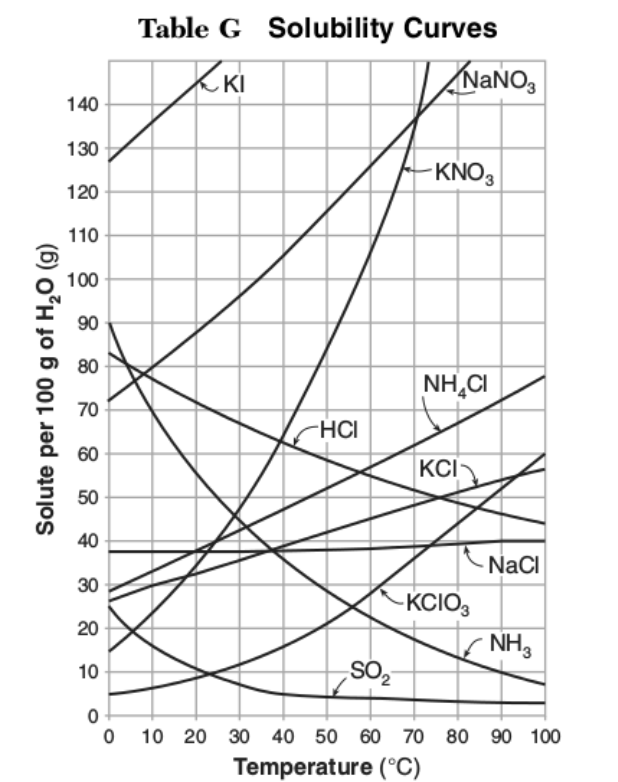

```{r setup, include=FALSE}
knitr::opts_chunk$set(echo = TRUE, fig.align="center", comment=NA)
library(knitr)
```

# R Markdown

This is an R Markdown document. Markdown is a simple formatting syntax for authoring HTML, PDF, and MS Word documents. For more details on using R Markdown see <http://rmarkdown.rstudio.com>.

When you click the **Knit** button a document will be generated that includes both content as well as the output of any embedded R code chunks within the document. You can embed an R code chunk like this:

```{r cars}
summary(cars)
```

# Enter Math

$A=\frac{B}{C}$


# Including Plots

You can also embed plots, for example:

```{r pressure, echo=FALSE}
plot(pressure)
```

Note that the `echo = FALSE` parameter was added to the code chunk to prevent printing of the R code that generated the plot.

```{r, fig.width=7.5, fig.height=2, fig.fullwidth=TRUE, fig.cap="Sunspot Data"}
par(mar = c(4, 4, .1, .2)); plot(sunspots)
```

```{r, echo=FALSE, out.width = "50%", fig.pos="h"}
include_graphics("R_logo.png")
```

Force a page break

```{r, results='asis', echo=FALSE, eval=(knitr::opts_knit$get('rmarkdown.pandoc.to') == 'latex')}
cat('\\pagebreak')
```

```{r, echo=FALSE, fig.height=6, fig.cap="Solubility Curves"}

```


