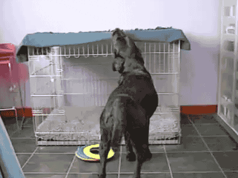

```{r setup, include=FALSE}
knitr::opts_chunk$set(echo = TRUE)
```

These are images downloaded from `giphy.com`

# A known working example

One can use a link to the site... That looks like this:

```
https://media.giphy.com/media/xUOxf7XfmpxuSode1O/giphy.gif
```


These are images downloaded as `.gif` files


